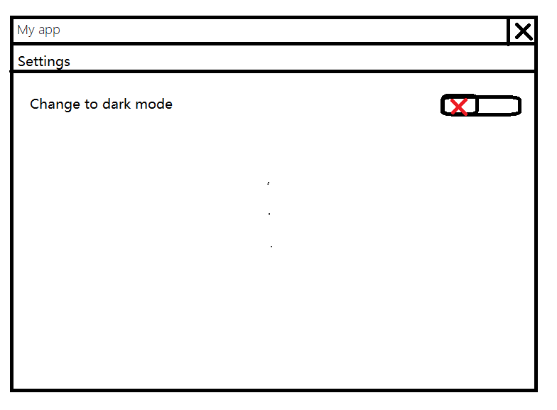

# 新功能请求模板（Feature Request）

感谢你提供的新功能请求！为了帮助我们更好地理解和评估该功能，请提供以下信息：

## 1. 功能描述
请简要描述你希望添加的功能，以及它将如何改善项目的使用体验。

例如：  
“我希望能在应用程序中增加一个主题切换功能，允许用户选择白色或黑色主题。”

## 2. 业务需求或动机
为什么你认为这个功能是有必要的？它解决了什么问题或改进了哪些方面？

例如：  
“在低光环境下，使用黑色主题可以减轻眼睛的疲劳，并节省电池。”

## 3. 预期行为
描述你希望该功能如何工作的，例如用户界面、交互流程或行为。

例如：
“在‘设置’界面，添加一个主题切换的开关，打开切换深色，否则使用浅色模式。”

## 4. 可行性或实现建议（可选）
如果你有任何关于如何实现该功能的想法或建议，请分享。

例如：  
“可以在设置菜单中添加主题选择项，并保存用户选择。”

## 5. 附加信息
任何其他你认为有助于该功能请求的信息。

例如：\

可以通过图片等方式呈现。